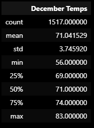
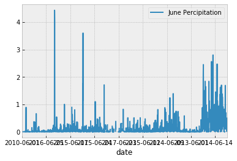
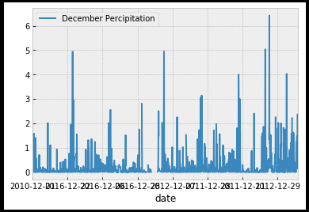

# surfs_up

Deliverable 3 Instructions
For this part of the Challenge, write a report that describes the key differences in weather between June and December and two recommendations for further analysis.

The analysis should contain the following:

Overview of the analysis: Explain the purpose of this analysis.
Results: Provide a bulleted list with three major points from the two analysis deliverables. Use images as support where needed.
Summary: Provide a high-level summary of the results and two additional queries that you would perform to gather more weather data for June and December.
Deliverable 3 Requirements
Structure, Organization, and Formatting (6 points)
The written analysis has the following structure, organization, and formatting:

There is a title, and there are multiple sections. (2 pt)
Each section has a heading and subheading. (2 pt)
Links to images are working and displayed correctly. (2 pt)
Analysis (14 points)
The written analysis has the following:

The differences between weather in June vs December

## Overview of the statistical analysis:

We were asked to analyze more information about temperature trends before the surf shop can open. We had to create a build a SQLite database, then use SQLAlqchemy to connect and query this datebase, and finally analyze the data to redesign into a Flask Application for readable usage. This was then expanded into pulling more information from this database to provide further data to be analyzised and designed for layman access.

## Results:

### The re-analyed data resulted in the provided examples:

- First we used HTML elements to figure out where we needed to specifically locate data from scraped websites to arrive at certain data points.

- First the supplied dataframe was combed to pull out data about the temperature in June across all of the years provided.

- Then, the dataframe was combed to pull out the data about the temperature in December across all of the years provided.

There is a bulleted list that addresses the three key differences in weather between June and December. (6 pt)

## Summary:

There is a high-level summary of the results and there are two additional queries to perform to gather more weather data for June and December. (5 pt

After the temperature data was extracted, the precipitation data was then extracted from the dataset into a plot for examination for the two months.

- In June:

- In December:

In comparison, the months of December experience
