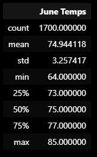

# surfs_up

After making a strong business plan and reaching out to a renowned surfer; W.Avy, you were able to secure him as an investor on the premise you could provide the data to make a dream into a reality. The issue was the local weather for the investor. After extracting, compiling, converting, and parsing data from local weather stations, you deciphered a positive environment for the business plans. The next question was the differences between weather in June vs December.

## Overview of the statistical analysis:

We were asked to analyze more information about temperature trends before the surf shop can open. We had to create a build a SQLite database, then use SQLAlchemy to connect and query this database, and finally analyze the data to redesign into a Flask Application for readable usage. This was then expanded into pulling more information from this database to provide further data to be analyzed and designed for layman access.

## Results:

### The re-analyzed data resulted in the provided examples:

- First, we used Python to figure out where we needed to specifically locate data from a database through queries to arrive at certain data points.

- Then, the created DataFrame was combed to pull out data about the temperature in June across all of the years provided.

- Also, the DataFrame was combed to pull out the data about the temperature in December across all of the years provided.

## Summary:

After the temperature data was extracted, the precipitation data was then extracted from the dataset into a plot for examination for the two separate months.

- In June:

- In December:

In comparison, the months of December experienced an increased amount of rain.

The takeaway is, as it is in the summer months, you should cash in then while it's ideal and (re)build in the "off months". It would be ideal to begin construction in the month and day that was ideal for the owner: August, 23. Then, in the fall, winter, spring you would begin building and openeing for the summer the year after, which would be proceeded with media hype. Great launch-off based on weather!
